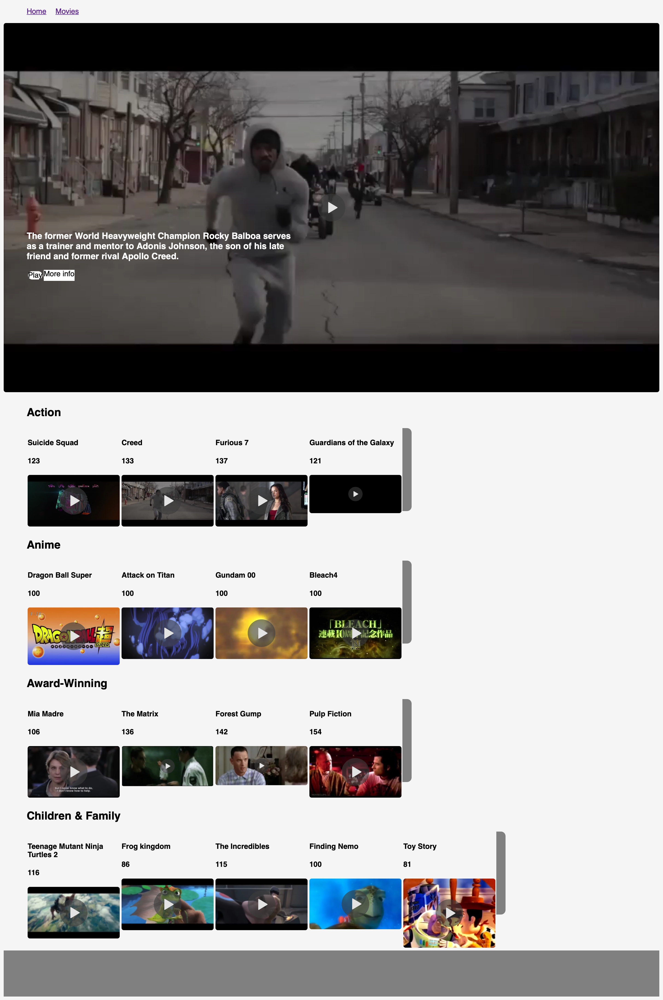

<h1 align="center">Netflix-project</h1>

This is a project in attempt to create a netflix-clone. IT uses ReactJS and GraphQL pagination to load data in front-end view. This project was created for learning and practicing Javascript with React.

## Links

- [Repo](https://github.com/maheshbhandari433/netflix-project "<project-name> Repo")

- [Live](https://netflix-project-01.netlify.app "Live View")

- [Bugs](https://github.com/maheshbhandari433/netflix-project/issues "Issues Page")

- [API](https://netflix-project-01.netlify.app "API")

## Screenshots

## Available Commands

In the project directory, you can run:

### `"netlify dev": "production-ready environment starts"`,

Launches the project in production-ready environment.

<h3>[Note: Make sure to install npm and netlify-cli]</h3>

### `npm start" : "react-scripts start"`,

The app is built using `create-react-app` so this command Runs the app in Development mode. Open [http://localhost:3000](http://localhost:3000) to view it in the browser. You also need to run the server file as well to completely run the app. The page will reload if you make edits.
You will also see any lint errors in the console.

### `"npm run build": "react-scripts build"`,

Builds the app for production to the `build` folder. It correctly bundles React in production mode and optimizes the build for the best performance. The build is minified and the filenames include the hashes. Your app will be ready to deploy!

### `"npm run test": "react-scripts test"`,

Launches the test runner in the interactive watch mode.

### `"npm run dev": "concurrently "nodemon server" "npm run start"`,

For running the server and app together I am using concurrently this helps a lot in the MERN application as it runs both the server (client and server) concurrently. So you can work on them both together.

### `"serve": "node server"`

For running the server file on you can use this command.

### `npm run serve`

## Built With

- JavaScript
- Node
- NPM
- React
- HTML
- CSS

## Future Updates

- API development

## Author

**Mahesh Bhandari**

- [Profile](https://github.com/maheshbhandari433)
- [Email](mailto:maheshbhandari433@gmail.com)
- [Website](https://github.com/maheshbhandari433)

## 🤝 Support

Contributions, issues, and feature requests are welcome!

Give a ⭐️ if you like this project!
